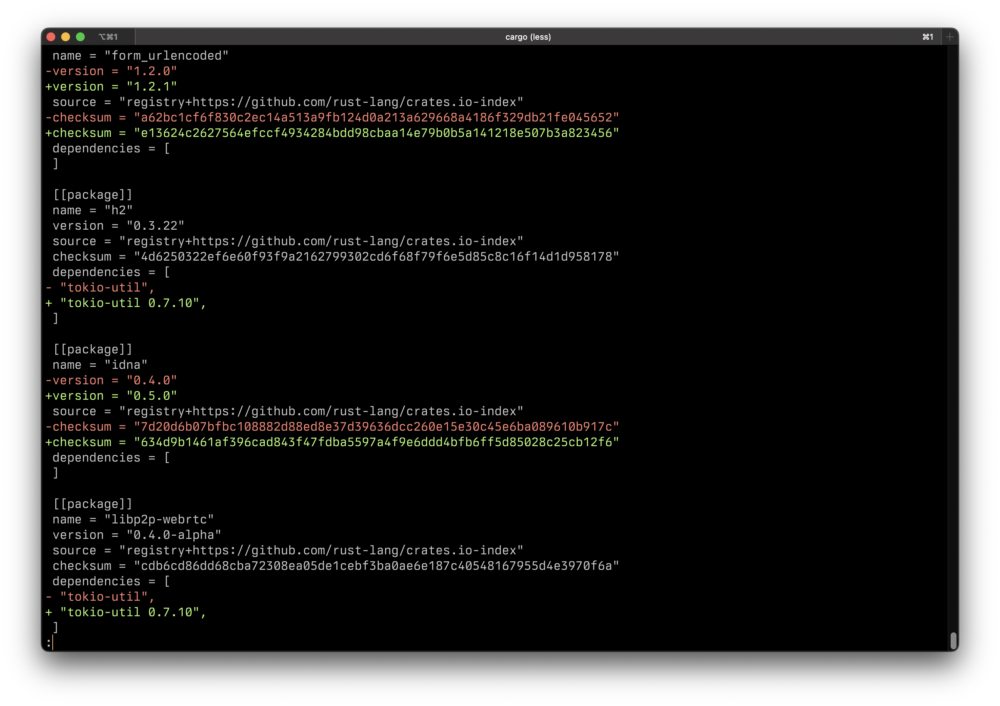

# 🔒 lock-diff

Diff between `Cargo.lock`!



## Usage

Using `lock-diff` is as simple as:

```
lock-diff <OLD-LOCK> <NEW-LOCK>
```

### Features:

- Pager support
- Only shows changes by default (use `-v` to get everything)
- Colorized out of the box (use `--no-color` to disable)


## Install

You can install `lock-diff` through `cargo`.

```
cargo install lock-diff
```

### Building from source

This crate does not depend on platform specific features, hence, building from source
should be as easy as doing:

```
git clone https://github.com/jmg-duarte/lock-diff.git
cd lock-diff
cargo install --path .
```
